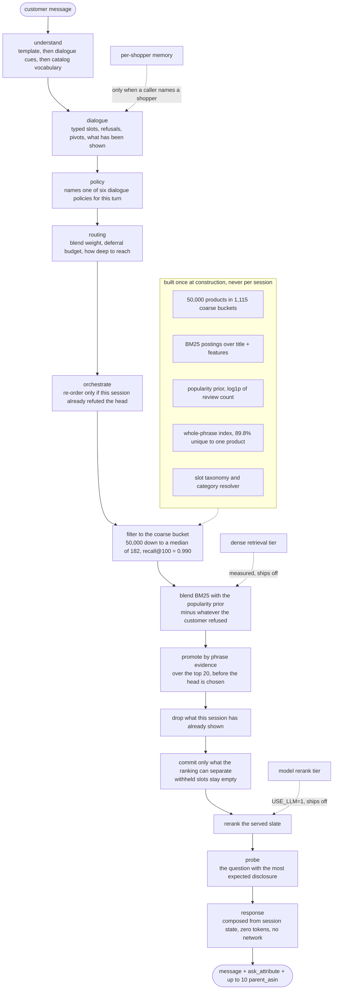

# Conversational Shopping Agent

Our entry for the TechJam 2026 conversational e-commerce search challenge.

A shopper describes what they want in their own words. The agent has ten turns
to put the one product they have in mind into a slate of ten, asking useful
clarifying questions along the way, over a frozen catalog of 50,000 Amazon
apparel products it has never been told the answer for.

**Result on the 200 released public sessions, scored by the organizer's own
evaluator:**

| scenario | n | HitRate@10 | MRR | MTTC | score |
|---|---|---|---|---|---|
| buying | 80 | 1.000 | 0.967 | 1.79 | 0.9744 |
| browsing | 80 | 1.000 | 0.970 | 2.05 | 0.9701 |
| intent_override | 30 | 1.000 | 1.000 | 4.03 | 0.9393 |
| boundary | 10 | 1.000 | 1.000 | 2.50 | 0.9700 |
| **overall** | **200** | **1.000** | **0.975** | **2.27** | **0.9672** |
| shipped baseline, for reference | 200 | 0.125 | 0.068 | 9.81 | 0.1067 |

**No network. No third-party packages. 0 tokens. $0.00.** The scored path is the
Python standard library and nothing else. An optional model-backed rerank tier
exists behind `USE_LLM=1`, was measured, lost, and ships switched off; with that
variable unset the agent imports nothing outside the stdlib and reads no
credential. Per-turn latency is p50 0.95 ms, p95 3.19 ms over 453 turns.

## How it works



Everything expensive happens once, at construction: 800 private sessions
re-parsing 50,000 JSONL records would blow any timeout. A turn allocates state
and reads indexes, and nothing else.

Turn 1 is never content-free: every opening message names a coarse product
category, and filtering the catalog to that bucket cuts 50,000 products to a
median of 182 at recall@100 = 0.990. Inside the bucket the agent blends lexical
matching over `title` + `features` with a popularity prior, at a weight where
**both halves stay load-bearing** -- the prior never reads the customer's words
so it survives rewording, and the lexical half never reads review counts so it
survives a change in how targets were sampled. Whole-phrase evidence then
promotes the pool, because 89.8% of the catalog's phrases belong to exactly one
product.

The slate itself is the least obvious part. A session ends the moment the target
appears anywhere in the served ten, at whatever rank it happened to occupy, so
showing a product is irreversible. The agent therefore commits only to what the
ranking can actually separate, leaves the remaining slots **empty** rather than
filling them with guesses, and opens to a full page once the customer has
nothing further to disclose. That policy is worth 0.0695 of the score on its own.

Full architecture, per-component measurements and cost disclosure:
**[`submission/README.md`](submission/README.md)**. The evidence behind every
claim: **[`docs/measurements.md`](docs/measurements.md)**.

## Setup

Python 3.10 or later (developed on 3.14). There are no dependencies to install.

```bash
git clone https://github.com/justin-theodorus/techjam.git
cd techjam
```

The catalog is ~19 MB packed and is not committed. Download `catalog.jsonl.gz`
from the GitHub Release on the organizer's repository,
[TechJam2026/techjam-conversational-search](https://github.com/TechJam2026/techjam-conversational-search),
verify it against the published `SHA256SUMS`, and place it at the root of this
checkout. Then:

```bash
make data     # unpacks it to data/catalog.jsonl
```

There is nothing to install. `submission/requirements.txt` is a manifest with no
packages in it, listed only so the reproduction steps read the same as everyone
else's; `pip install -r submission/requirements.txt` is a no-op. No API key, no
environment variable and no network access is required for any number in this
repository.

If you do not have `make`, or `gzip`, that step is one Python command:

```bash
python3 -c "import gzip,shutil; shutil.copyfileobj(gzip.open('catalog.jsonl.gz','rb'), open('data/catalog.jsonl','wb'))"
```

## Reproduce our results

**The shortest path, and the one that needs nothing but Python.** This is the
organizer's own entry point, unmodified; it imports our agent through
`starter/agent.py` and writes the full result to `results.json`:

```bash
python3 -m evaluator.local_evaluator     # ~7 s
```

```json
{
  "sample_count": 200,
  "hit_rate_at_10": 1.0,
  "mrr": 0.975042,
  "mttc": 2.265,
  "efficiency": 0.8735,
  "recommended_technical_score": 0.967213,
  "reported_token_usage": {"prompt_tokens": 0, "completion_tokens": 0, "total_tokens": 0}
}
```

`results.json` also carries `scenario_metrics` for all four scenarios and a
per-session record of rank and converting turn.

**The same score, with more of the story:**

```bash
make eval        # 0.9672 -- ~20 s
```

That adds the per-scenario table above, a health line and a diff against the
previous run. **Read the health line, not just the score:** the evaluator
swallows an agent exception into an empty turn, so a crash is invisible in the
score and has to be surfaced separately. `exceptions=0 discarded=0` is the real
gate, and it is the one thing `results.json` cannot tell you.

`short_slates` is *not* a fault. It counts turns that served fewer than ten
recommendations, which is the deferred-commitment policy described above doing
its job.

The rest of the battery, and what each should print:

| command | equivalent without `make` | what it varies | expected |
|---|---|---|---|
| `make eval` | `python3 -m harness.run` | nothing | **0.9672** |
| `make baseline` | `python3 -m harness.run --agent starter.baseline_agent:Agent --check-baseline` | nothing; asserts the frozen reference | exactly **0.10671** |
| `make split` | `python3 -m harness.run --split dev` then `--split held` | which half of the public set | dev **0.9637** / held **0.9707** |
| `make risk` | `python3 -m harness.counterfactual` | how targets are drawn | size-biased 0.9644, sqrt 0.9345, uniform **0.9139** |
| `make paraphrase` | `python3 -m harness.paraphrase` | how the customer words things | reworded 0.9575, punctuation 0.9590, filler 0.9516, synonym **0.9318** |
| `make sessions` | `python3 -m harness.sessions` | 23 frozen synthetic session sets | 99.0% rank-1 down to 16.0% |
| `make deviations` | `python3 -m harness.deviations` | every component with a live switch, on all of the above | ~7 min |
| `make memory` | `python3 -m harness.returning` | whether a returning shopper converts faster | not a score |
| `make test` | see below | the suite | 566 tests, all green |
| -- | `python3 -m harness.run --no-fast-path` | template matching disabled entirely | **0.9660** |

`make` is only a wrapper; every target is one standard-library Python command.
Run them from the repository root, which is what puts the packages on the import
path. The test suite is three commands:

```bash
python3 -m unittest discover -s tests
python3 -m unittest discover -s harness/tests -t .
python3 -m unittest discover -s submission/src/tests -t .
```

Two commands cost money or need credentials and are excluded from every reported
number: `make llm` (the model rerank tier) and `make dense` (the dense retrieval
tier). Both components ship switched off.

## Limitations

**The headline is conditional, and the condition is measurable.** Sessions are
sampled from review records, so a product's chance of being the target is
proportional to its review count. That makes the popularity prior worth more
than every constraint in the conversation -- an agent that ignores every word the
customer says still scores 0.7133. If the private set draws targets differently,
that component swings, which is why `make risk` exists and why the blend weight
sits mid-range rather than at the public optimum. Read the `uniform` column
(0.9139) as a pessimistic bound.

**The public 200 can no longer separate a good idea from a bad one.** It is
saturated: HitRate@10 is 1.000 and 176 of 200 sessions convert at rank 1, so any
change has 24 sessions of upside against 176 of downside. Every verdict in this
repository that was taken on it alone has been re-taken against 23 manufactured
session sets spanning 99% rank-1 down to 16%. Two of those re-readings reversed
an explanation we had already written down.

**The largest single gain is conditional on difficulty.** Emptying the withheld
slate slots is worth +0.0160 on the public 200 and every pessimistic column
agrees, but on the hardest frozen sets it reads +0.0092 *in favour of reverting*,
because there coverage binds rather than rank. A coverage-conditional version is
the obvious insurance and is not built.

**Understanding is tuned to a simulated customer.** The message reader was
developed against the reference simulator's dialogue. Disabling its template fast
path entirely costs only 0.0012 (0.9672 to 0.9660), so nothing rests on exact
strings, but a genuinely human conversation is untested.

**Two components the brief names are built, measured and switched off.** Dense
retrieval loses on 14 of 15 readable sets, because a latent space's leading
dimensions encode category -- exactly what the bucket filter already applies. The
model-backed rerank scored 0.9333 against 0.9554 offline at the commit both were
taken at, not because the model is bad at the task but because 180 of 200
sessions already convert at rank 1, so its error rate on those outweighs its
success rate on the rest by 22 to 1. Both keep live switches and tests asserting
they are off, so they are reported results rather than missing features.

**Per-shopper memory is real but unreachable through the published API.** The
contract closes `reset_request` and `user_profile` with
`additionalProperties: false`, and the evaluator issues a fresh session id every
time, so there is no field an identity could travel in. It is implemented, and it
is only observable through a harness that supplies identity alongside the real
evaluator.

**There is no measurable latency budget.** The local evaluator has no timeout
anywhere, so the per-turn budget in the rules cannot be checked here. We treat it
as unknown and keep everything in memory and built once at construction.

### Given more time

- **Make the short slate coverage-conditional.** It is the one shipped decision
  whose sign depends on how hard the private set is. Gating it on a coverage
  estimate rather than shipping it unconditionally is cheap insurance.
- **Re-measure the model tier against the current offline path.** It was
  measured at 0.9554 and the offline agent has since reached 0.9672, so the
  honest reading today is "it lost by 0.022 at the commit where both were
  taken", not "it loses".
- **Evaluate the dialogue against humans.** Question phrasing is worth exactly
  zero to the technical score -- the simulator type-checks `message` and never
  reads it -- and the technical score is 35% of judging. We built the reply layer
  anyway; we have no way to tell whether it is any good.
- **Reach customer-side evidence for the probe.** The question policy scores
  attributes by what *products* declare, while disclosure depends on how the
  *customer* classifies their own preference. Those are different functions and
  the gap is visible.

## Team

| contributor | area |
|---|---|
| **Justin Stevenson Theodorus** | Retrieval and ranking, and the measurement harness the whole project is argued from: the robustness gates, the synthetic session sets, and the sweep that re-reads every component where it still has room to move |
| **Angelica Gonathan** | Deferred commitment -- deciding how much of the ranking a turn should reveal, and deriving that from how well the ranking separates rather than fixing it in advance. The largest scoring gain in the project |
| **Catherine Kang** | The customer-facing side of the dialogue: what the agent says about the slate it is serving, how it reads a constraint back, and what asking a real question costs |
| **Azka Tazkiatunnafsi** | The demo: its flow and narrative structure, and the video itself |

## Layout

```
submission/          the deliverable bundle
  agent.py             entry point, exports Agent
  requirements.txt     stdlib only; installs nothing
  README.md            the full technical report
  assets/dense.bin     4.92 MB latent index, shipped at weight 0
  src/                 19 modules, read in the order README lists them
  src/tests/           455 tests
harness/             measurement and robustness gates; not part of the bundle
docs/measurements.md the evidence behind every claim in the code comments
evaluator/           the organizer's simulator and scorer. Read-only.
starter/             agent.py is the import path the evaluator uses;
                     baseline_agent.py is the organizer's shipped reference
data/                public_set.jsonl, plus the catalog you download
tools/               offline builders; never run at scoring time
```

`evaluator/`, `tests/`, `data/` and the organizer's files under `docs/` are not
edited. `starter/baseline_agent.py` is a verbatim copy of the shipped agent, kept
so `make baseline` can assert the frozen reference still holds.

## Data and attribution

The catalog and sessions are derived from Amazon Reviews 2023 by McAuley Lab,
UCSD. See [`DATA_ATTRIBUTION.md`](DATA_ATTRIBUTION.md) before using or
redistributing the data.

Competition documents: [`docs/competition_specification.md`](docs/competition_specification.md),
[`docs/submission_rules.md`](docs/submission_rules.md),
[`docs/agent_api_contract.json`](docs/agent_api_contract.json).
